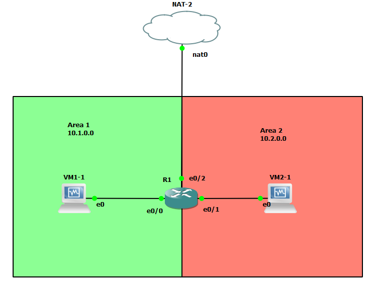
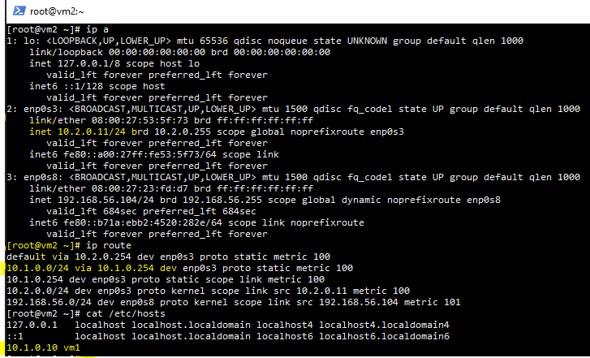
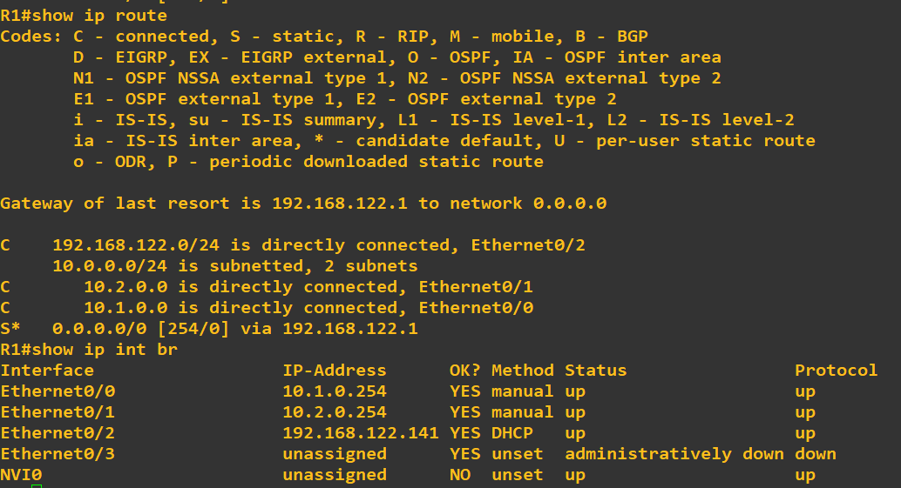
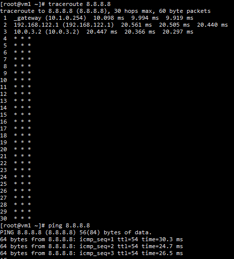
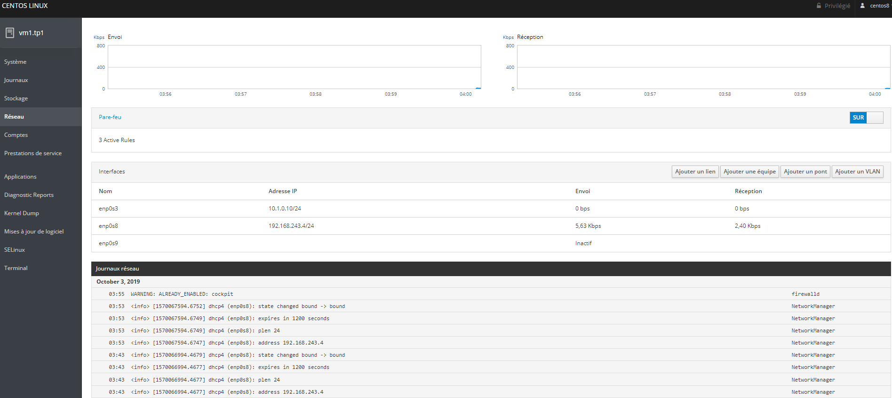
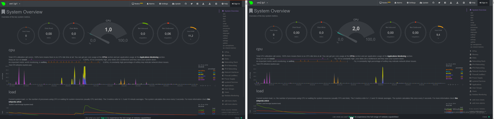

# TP1 : Back to basics

# Sommaire

* [Intro](#intro)
* [I. Gather informations](#i-gather-informations)
* [II. Edit configurtion](#ii-edit-configuration)
  * [1. Configuration cartes réseau](#1-configuration-cartes-réseau)
  * [2. Serveur SSH](#2-serveur-ssh)
* [III. Routage simple](#iii-routage-simple)
* [IV. Autres applications et métrologie](#iv-autres-applications-et-métrologie)
  * [1. Commandes](#1-commandes)
  * [2. Cockpit](#2-cockpit)
  * [3. Netdata](#3-netdata)

# Intro


# I. Gather informations

**Première étape : récupération d'infos sur le système.**  
Vous arrivez sur une nouvelle machine, et vous avez besoin de connaître sa configuration réseau. Ce sera essentiel en cas de soucis. 

*Des trucs vous paraissent un peu cons ? C'est pour manipuler et se remettre dans le bain, n'hésitez pas à me faire rendu concis pour les parties qui vous paraissent izi.*

Commandes à utiliser (ou pas) : `ip`, `ss`, `nmcli`, `cat`, `dig`, `firewall-cmd`

* 🌞 récupérer une **liste des cartes réseau** avec leur nom, leur IP et leur adresse MAC

```
[root@localhost ~]# ip a
1: lo:                                                      Nom
    link/loopback 00:00:00:00:00:00 brd 00:00:00:00:00:00   Mac
    inet 127.0.0.1/8 scope host lo                          IP
2: enp0s3:                                                  Nom
    link/ether 08:00:27:e7:9f:00 brd ff:ff:ff:ff:ff:ff      Mac
    inet 10.0.2.15/24 brd 10.0.2.255  IP
3: enp0s8:                                                  Nom
    link/ether 08:00:27:90:ea:90 brd ff:ff:ff:ff:ff:ff      MAC
    inet 192.168.56.101/24 brd 192.168.56.255               IP 
```


* 🌞 déterminer si les cartes réseaux ont récupéré une **IP en DHCP** ou non
  ```powershell
  [root@localhost network-scripts]# sudo nmcli -f DHCP4 con show enp0s3
    DHCP4.OPTION[1]:                        domain_name = auvence.co
    DHCP4.OPTION[2]:                        domain_name_servers = 10.33.10.20 10.33.10.2 8.8.8.8 8.8.4.4
    DHCP4.OPTION[3]:                        expiry = 1569590969
    DHCP4.OPTION[4]:                        ip_address = 10.0.2.15
    DHCP4.OPTION[22]:                       routers = 10.0.2.2
    DHCP4.OPTION[23]:                       subnet_mask = 255.255.255.0
    [root@localhost network-scripts]# sudo nmcli -f DHCP4 con show enp0s8
    DHCP4.OPTION[1]:                        expiry = 1569505753
    DHCP4.OPTION[2]:                        ip_address = 192.168.56.101
    DHCP4.OPTION[20]:                       subnet_mask = 255.255.255.0
  ```
    Ils ont des temps d'expiration donc ils utilisent un DHCP.

    
* 🌞 afficher la **table de routage** de la machine et sa **table ARP**

```powershell
[root@localhost NetworkManager]# arp -a
? (192.168.56.100) at 08:00:27:1c:5d:48 [ether] on enp0s8
_gateway (10.0.2.2) at 52:54:00:12:35:02 [ether] on enp0s3
? (192.168.56.103) at 0a:00:27:00:00:06 [ether] on enp0s8
[root@localhost NetworkManager]# ip route
default via 10.0.2.2 dev enp0s3 proto dhcp metric 102
10.0.2.0/24 dev enp0s3 proto kernel scope link src 10.0.2.15 metric 102
192.168.56.0/24 dev enp0s8 proto kernel scope link src 192.168.56.101 metric 101
```
  * cette route est vers le réseau nat 10.0.2.0 , elle est utilisée pour une connexion externe, la passerelle de cette route est à l'IP 10.0.2.2 et cette IP est portée par enp0s3

  * cette route est vers le réseau privé hote 192.168.56.0 , elle est utilisée pour une connexion locale, la passerelle de cette route est à l'IP 192.168.56.100 et cette IP est portée par enp0s8


* 🌞 récupérer **la liste des ports en écoute** (*listening*) sur la machine (TCP et UDP)
  * ```powershell
    [root@localhost NetworkManager]# ss -lput
        Netid          State            Recv-Q           Send-Q                                Local Address:Port                         Peer Address:Port
        udp            UNCONN           0                0                             192.168.56.101%enp0s8:bootpc                            0.0.0.0:*               users:(("NetworkManager",pid=806,fd=22))
        udp            UNCONN           0                0                                  10.0.2.15%enp0s3:bootpc                            0.0.0.0:*               users:(("NetworkManager",pid=806,fd=19))
        udp            UNCONN           0                0                                         127.0.0.1:323                               0.0.0.0:*               users:(("chronyd",pid=770,fd=6))
        udp            UNCONN           0                0                                             [::1]:323                                  [::]:*               users:(("chronyd",pid=770,fd=7))
        tcp            LISTEN           0                128                                         0.0.0.0:ssh                               0.0.0.0:*               users:(("sshd",pid=824,fd=6))
        tcp            LISTEN           0                128                                            [::]:ssh                                  [::]:*               users:(("sshd",pid=824,fd=8))
    ```
* 🌞 récupérer **la liste des DNS utilisés par la machine**

  * ```
    [root@localhost etc]# cat resolv.conf
    # Generated by NetworkManager
    search auvence.co
    nameserver 10.33.10.20
    nameserver 10.33.10.2
    nameserver 8.8.8.8
    ```
  * ```
    [root@localhost etc]# dig www.reddit.com

    ; <<>> DiG 9.11.4-P2-RedHat-9.11.4-17.P2.el8_0.1 <<>> www.reddit.com
    ;; global options: +cmd
    ;; Got answer:
    ;; ->>HEADER<<- opcode: QUERY, status: NOERROR, id: 57724
    ;; flags: qr rd ra; QUERY: 1, ANSWER: 5, AUTHORITY: 13, ADDITIONAL: 27
    ```

* 🌞 afficher **l'état actuel du firewall**
  * ```
    [root@localhost etc]# firewall-cmd --list-all
        public (active)
        target: default
        icmp-block-inversion: no
        interfaces: enp0s3 enp0s8
        sources:
        services: cockpit dhcpv6-client ssh
        ports:
        protocols:
        masquerade: no
        forward-ports:
        source-ports:
        icmp-blocks:
        rich rules:
    ```
Les interfaces filtrées sont enp0s3 et la s8 et dans la mesure où nous avons fais un petit set enforce 0 nous n'avons plus aucun TCP ou UDP de filtrées.

## II. Edit configuration

**Deuxièmement : Modifier la configuration existante**

Commandes à utiliser (ou pas) : `vim`, `cat`, `nmcli`, `systemctl`, `firewall-cmd`

---

### 1. Configuration cartes réseau

---

* 🌞 modifier la configuration de la carte réseau privée
  * ```
    [root@localhost network-scripts]# cat ifcfg-enp0s8
    BOOTPROTO=static
    DEVICE=enp0s8
    NAME=enp0s8
    ONBOOT=yes
    IPADDR=192.168.56.105
    ```
* ajouter une nouvelle carte réseau dans un DEUXIEME réseau privé UNIQUEMENT privé
  * ```
        [root@localhost network-scripts]# ip a
    1: lo: <LOOPBACK,UP,LOWER_UP> mtu 65536 qdisc noqueue state UNKNOWN group default qlen 1000
        link/loopback 00:00:00:00:00:00 brd 00:00:00:00:00:00
        inet 127.0.0.1/8 scope host lo
        valid_lft forever preferred_lft forever
        inet6 ::1/128 scope host
        valid_lft forever preferred_lft forever
    2: enp0s3: <BROADCAST,MULTICAST,UP,LOWER_UP> mtu 1500 qdisc fq_codel state UP group default qlen 1000
        link/ether 08:00:27:e7:9f:00 brd ff:ff:ff:ff:ff:ff
        inet 10.0.2.15/24 brd 10.0.2.255 scope global dynamic noprefixroute enp0s3
        valid_lft 86098sec preferred_lft 86098sec
        inet6 fe80::4ad6:a897:e477:132f/64 scope link noprefixroute
        valid_lft forever preferred_lft forever
    3: enp0s8: <BROADCAST,MULTICAST,UP,LOWER_UP> mtu 1500 qdisc fq_codel state UP group default qlen 1000
        link/ether 08:00:27:90:ea:90 brd ff:ff:ff:ff:ff:ff
        inet 192.168.56.105/24 brd 192.168.56.255 scope global noprefixroute enp0s8
        valid_lft forever preferred_lft forever
        inet6 fe80::a00:27ff:fe90:ea90/64 scope link
        valid_lft forever preferred_lft forever
    4: enp0s9: <BROADCAST,MULTICAST,UP,LOWER_UP> mtu 1500 qdisc fq_codel state UP group default qlen 1000
        link/ether 08:00:27:9d:c4:27 brd ff:ff:ff:ff:ff:ff
        inet 192.168.252.3/24 brd 192.168.252.255 scope global noprefixroute enp0s9
        valid_lft forever preferred_lft forever
        inet6 fe80::a00:27ff:fe9d:c427/64 scope link tentative
        valid_lft forever preferred_lft forever
    ```
* vérifier vos changements
  * ```
    [root@localhost network-scripts]# route
        Kernel IP routing table
        Destination     Gateway         Genmask         Flags Metric Ref    Use Iface
        default         _gateway        0.0.0.0         UG    100    0        0 enp0s3
        10.0.2.0        0.0.0.0         255.255.255.0   U     100    0        0 enp0s3
        192.168.56.0    0.0.0.0         255.255.255.0   U     101    0        0 enp0s8
        192.168.252.0   0.0.0.0         255.255.255.0   U     102    0        0 enp0s9
        [root@localhost network-scripts]# arp
        Address                  HWtype  HWaddress           Flags Mask            Iface
        _gateway                 ether   52:54:00:12:35:02   C                     enp0s3
        192.168.56.103           ether   0a:00:27:00:00:06   C                     enp0s8
    ```
---

### 2. Serveur SSH

* 🌞 modifier la configuration du système pour que le serveur SSH tourne sur le port 2222
  * ```
    [root@localhost ~]# firewall-cmd --list-ports
    2222/tcp
    ```

# III. Routage simple

Mon gns.

* 🌞 **To Do** 
  * Tableau récapitulatif des IPs
    *Machines | `10.1.0.0/24` | `10.2.0.0/24` | `192.168.122.0/24`
    --- | --- | --- | ---
    `R1` | `10.1.0.254` | `10.2.0.254` | `192.168.122.141` 
    `VM1-1` | `10.1.0.10` | - | -
    `VM2-1` | - | `10.2.0.11` | -
    <br> <br> <br>
  * 
    Comme tu peux le voir en surligner jaune, j'ai redéfini l'adresse ip de ma vm, j'ai renomé ma vm, je lui ai ajouté une route jusqu'à l'autre réseaux via ma gateway présent sur mon router (que tu vas voir à la suite) et enfin tu vois aussi que j'ai créé un host pour ping ma vm1

    Je vais t'épargner le spam en te montrant la config de la vm1 où il n'y a que les ips qui changent. <br> <br> <br>

    
  * La configuration de mon router
    
    En te basant sur ma captur GNS et en la recoupant avec le tableau et la capture ci dessous tu peux voir que j'ai fais en sorte que mon router soit la gateway des 2 réseaux (normal) et qu'il soit connecté à la nat.
  * 
    J'ai du installer traceroute à la main (`yum install traceroute`)
    Sur le traceroute tu peux voir que mon traceroute passe par la gateway du réseaux, passe par mon router et enfin l'adresse ip de ma box et puis il se perd avec des * * * (je sais pas pouruoi). Donc j'ai rajouté un `ping 8.8.8.8` pour te prouver que ma vm a quand même accés à google.

# IV. Autres applications et métrologie

## 1. Commandes

* N'ayant pas pu installer iftop sur ma vm je vais simplement faire un résumé de ce que j'ai pu comprendre via mon ami google
    * iftop nous permets de listé chacunes des connexions actuels sur la machine via une interface avec des barres de chargement (youhou). C'est completment le graphique du débit utilisé que l'on peut avoir dans la catégorie performance du gestionnaire des tâches sous windows mais avec un détail de chacune des utilisations de se débit. 

---

## 2. Cockpit

* 🌞 mettre en place cockpit sur la VM1
    ```
    [root@vm1 ~]# ss -lput
    Netid          State            Recv-Q            Send-Q                               Local Address:Port                         Peer Address:Port
    udp            UNCONN           0                 0                             192.168.243.4%enp0s8:bootpc                            0.0.0.0:*               users:(("NetworkManager",pid=799,fd=22))
    udp            UNCONN           0                 0                                        127.0.0.1:323                               0.0.0.0:*               users:(("chronyd",pid=763,fd=6))
    udp            UNCONN           0                 0                                            [::1]:323                                  [::]:*               users:(("chronyd",pid=763,fd=7))
    tcp            LISTEN           0                 128                                        0.0.0.0:ssh                               0.0.0.0:*               users:(("sshd",pid=816,fd=6))
    tcp            LISTEN           0                 128                                           [::]:ssh                                  [::]:*               users:(("sshd",pid=816,fd=8))
    tcp            LISTEN           0                 128                                              *:websm                                   *:*               users:(("cockpit-ws",pid=31481,fd=3),("systemd",pid=1,fd=61))
    ```
    Et bah j'aurais bien voulu te dire les ports utilisé par cockpit (dernière ligne) mais il veut pas me le dire, je suis tristesse. EN lisant le man je vois qu'il est censé être sur le port 9090.
* 
    J'avou c'est stylé, petite interface de gestion de la VM.
    Je me suis un peu baladé, c'est vachement parlant cette interface, c'est juste trop bien
    Si jamais des gens passent par ici, j'ai suivit ce "[tuto](https://www.vultr.com/docs/how-to-install-cockpit-on-centos-7)" pour m'y connecter (c'est la même installation sur centos 7 et 8)

---

## 3. Netdata

Netdata est un outil utilisé pour récolter des métriques et envoyer des alertes. Il peut aussi être utilisé afin de visionner ces métriques, à court terme. Nous allons ici l'utiliser pour observer les métriques réseau et mettre en place un service web supplémentaire.

* 
C'est vraiment trop stylé, j'ai vraiment pris mon pied entre tant de facilité d'utilisation avec cockpit et tant de graphique avec netdata, c'est tellement beau et pratique !!!!
Encore une fois, pour les randoms de passage, le [tuto d'installation](https://computingforgeeks.com/how-to-install-netdata-on-rhel-8-centos-8/)