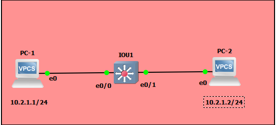
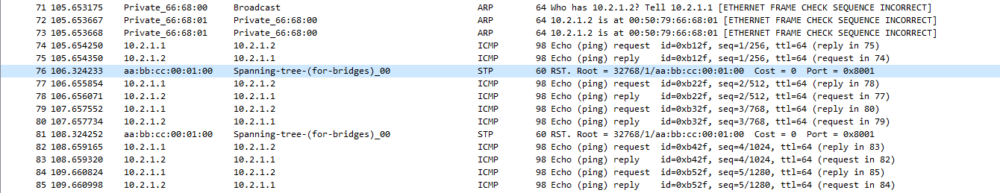
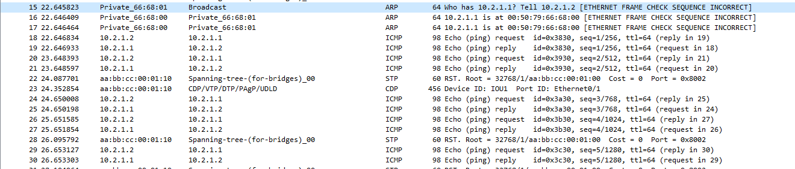
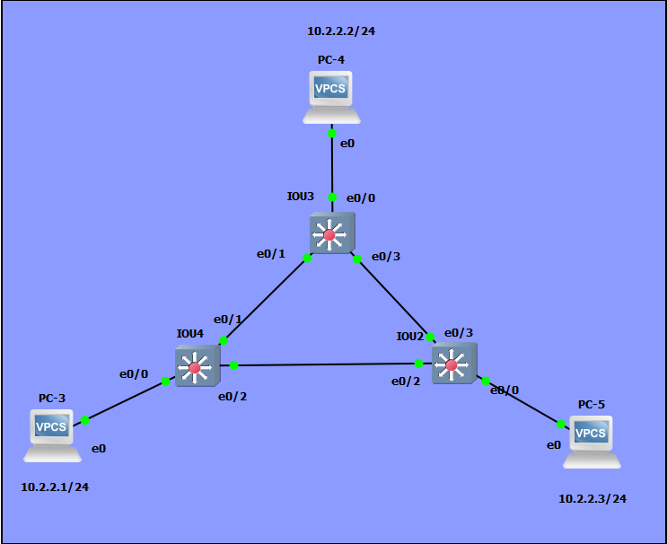
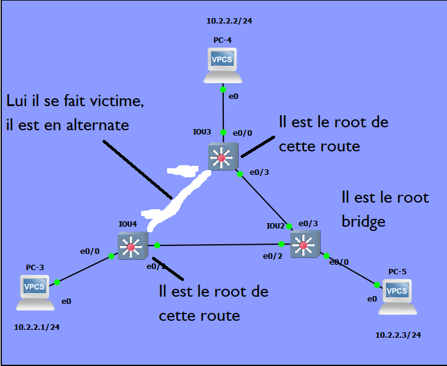

# TP2 : Network low-level, Switching

# Sommaire

* [I. Simplest setup](#i-simplest-setup)
  * [Topologie](#topologie)
  * [Plan d'adressage](#plan-dadressage)
  * [ToDo](#todo)
* [II. More switches](#ii-more-switches)
  * [Topologie](#topologie-1)
  * [Plan d'adressage](#plan-dadressage-1)
  * [ToDo](#todo-1)
  * [Mise en évidence du Spanning Tree Protocol](#mise-en-évidence-du-spanning-tree-protocol)
* [III. Isolation](#iii-isolation)
  * [1. Simple](#1-simple)
    * [Topologie](#topologie-2)
    * [Plan d'adressage](#plan-dadressage-2)
    * [ToDo](#todo-2)
  * [2. Avec trunk](#2-avec-trunk)
    * [Topologie](#topologie-3)
    * [Plan d'adressage](#plan-dadressage-3)
    * [ToDo](#todo-3)
* [IV. Need perfs](#iv-need-perfs)
  * [Topologie](#topologie-4)
  * [Plan d'adressage](#plan-dadressage-4)
  * [ToDo](#todo-4)


# I. Simplest setup

#### Topologie

```
+-----+        +-------+        +-----+
| PC1 +--------+  SW1  +--------+ PC2 |
+-----+        +-------+        +-----+
```


#### Plan d'adressage

Machine | `net1`
--- | ---
`PC1` | `10.2.1.1/24`
`PC2` | `10.2.1.2/24`

#### ToDo
* Premier ping de la vm1 à la 2
  * 
    ligne 71 à 73 demande ARP pour connaitre à qui appartient l'ip demandé lors du ping 
    ligne 74 à 85 protocole ICMP ping l'adresse ip demandé.
<br><br><br>

* Premier ping de la vm2 à la 1
  * 
    ligne 15 à 17 demande ARP pour connaitre à qui appartient l'ip demandé lors du ping 
    ligne 18 à 30 protocole ICMP ping l'adresse ip demandé.
* 🌞 expliquer...
  * pourquoi le switch n'a pas besoin d'IP
    * Un switch n'a pas besoin d'IP car une demande ARP fonctionne avec la MAC, au moment de faire la demande ARP, elle passe par l'adresse mac de broadcast qui est celle du switch, et ce dernier renvoi vers chacunes des machines qui lui sont connecté.
  * pourquoi les machines ont besoin d'une IP pour pouvoir se `ping`
    * Les machines ont besoin d'une adresse IP pour pouvoir se `ping` car le protocole ICMP est encapsulé dans un paquet IP qui demande l'IP du destinataire. 

# II. More switches

#### Topologie

```
                        +-----+
                        | PC2 |
                        +--+--+
                           |
                           |
                       +---+---+
                   +---+  SW2  +----+
                   |   +-------+    |
                   |                |
                   |                |
+-----+        +---+---+        +---+---+        +-----+
| PC1 +--------+  SW1  +--------+  SW3  +--------+ PC3 |
+-----+        +-------+        +-------+        +-----+
```

#### Plan d'adressage

Machine | `net1`
--- | ---
`PC3` | `10.2.2.1/24`
`PC4` | `10.2.2.2/24`
`PC5` | `10.2.2.3/24`

#### ToDo
* ```Bash
  PC-3> ping 10.2.2.2
  84 bytes from 10.2.2.2 icmp_seq=1 ttl=64 time=2.385 ms
  ```
  ```Bash
  PC-4> ping 10.2.2.1
  84 bytes from 10.2.2.1 icmp_seq=1 ttl=64 time=0.496 ms
  ```
  ```Bash
  PC-5> ping 10.2.2.3
  84 bytes from 10.2.2.3 icmp_seq=1 ttl=64 time=0.265 ms
  ```

* 🌞 analyser la table MAC d'un switch
  * ```
    Vlan    Mac Address       Type        Ports
    ----    -----------       --------    -----
      1    0050.7966.6802    DYNAMIC     Et0/0
      1    0050.7966.6803    DYNAMIC     Et0/2
      1    0050.7966.6804    DYNAMIC     Et0/2
      1    aabb.cc00.0220    DYNAMIC     Et0/2
      1    aabb.cc00.0330    DYNAMIC     Et0/2
      1    aabb.cc00.0410    DYNAMIC     Et0/2
    ```
    Les 3 premières lignes sont les adresses mac des PC3, PC4 et PC5, les 3 autres sont les addresses mac de chacun des switch en sachant que toutes les informations sont passées par le port 0/2 du switch 3, sauf la première qui vient du PC-3

#### Mise en évidence du Spanning Tree Protocol

STP a été ici automatiquement configuré par les switches eux-mêmes pour éviter une boucle réseau. 

Dans une configuration pareille, les switches ont élu un chemin de préférence.  
Si on considère les trois liens qui unissent les switches :
* `SW1` <> `SW2`
* `SW2` <> `SW3`
* `SW1` <> `SW3`  

**L'un de ces liens a forcément été désactivé.**

On va regarder comment STP a été configuré.

* SW4
  ```
  VLAN0001
  Spanning tree enabled protocol rstp
  Root ID    Priority    32769
             Address     aabb.cc00.0200
             Cost        100
             Port        3 (Ethernet0/2)
             Hello Time   2 sec  Max Age 20 sec  Forward Delay 15 sec

  Bridge ID  Priority    32769  (priority 32768 sys-id-ext 1)
             Address     aabb.cc00.0400
             Hello Time   2 sec  Max Age 20 sec  Forward Delay 15 sec
             Aging Time  300 sec

  Interface           Role Sts Cost      Prio.Nbr Type
  ------------------- ---- --- --------- -------- --------------------------------
  Et0/0               Desg FWD 100       128.1    Shr
  Et0/1               Altn BLK 100       128.2    Shr
  Et0/2               Root FWD 100       128.3    Shr
  Et0/3               Desg FWD 100       128.4    Shr
  Et1/0               Desg FWD 100       128.5    Shr
  Et1/1               Desg FWD 100       128.6    Shr
  Et1/2               Desg FWD 100       128.7    Shr
  Et1/3               Desg FWD 100       128.8    Shr
  Et2/0               Desg FWD 100       128.9    Shr
  Et2/1               Desg FWD 100       128.10   Shr
  Et2/2               Desg FWD 100       128.11   Shr
  Et2/3               Desg FWD 100       128.12   Shr
  Et3/0               Desg FWD 100       128.13   Shr
  Et3/1               Desg FWD 100       128.14   Shr
  Et3/2               Desg FWD 100       128.15   Shr
  Et3/3               Desg FWD 100       128.16   Shr
  ```
  <br><br>
  SW3
  ```
  VLAN0001
  Spanning tree enabled protocol rstp
  Root ID    Priority    32769
             Address     aabb.cc00.0200
             Cost        100
             Port        4 (Ethernet0/3)
             Hello Time   2 sec  Max Age 20 sec  Forward Delay 15 sec

  Bridge ID  Priority    32769  (priority 32768 sys-id-ext 1)
             Address     aabb.cc00.0300
             Hello Time   2 sec  Max Age 20 sec  Forward Delay 15 sec
             Aging Time  300 sec

  Interface           Role Sts Cost      Prio.Nbr Type
  ------------------- ---- --- --------- -------- --------------------------------
  Et0/0               Desg FWD 100       128.1    Shr
  Et0/1               Desg FWD 100       128.2    Shr
  Et0/2               Desg FWD 100       128.3    Shr
  Et0/3               Root FWD 100       128.4    Shr
  Et1/0               Desg FWD 100       128.5    Shr
  Et1/1               Desg FWD 100       128.6    Shr
  Et1/2               Desg FWD 100       128.7    Shr
  Et1/3               Desg FWD 100       128.8    Shr
  Et2/0               Desg FWD 100       128.9    Shr
  Et2/1               Desg FWD 100       128.10   Shr
  Et2/2               Desg FWD 100       128.11   Shr
  Et2/3               Desg FWD 100       128.12   Shr
  Et3/0               Desg FWD 100       128.13   Shr
  Et3/1               Desg FWD 100       128.14   Shr
  Et3/2               Desg FWD 100       128.15   Shr
  Et3/3               Desg FWD 100       128.16   Shr
  ```
  <br><br>
  SW2
  ```
  VLAN0001
  Spanning tree enabled protocol rstp
  Root ID    Priority    32769
             Address     aabb.cc00.0200
             This bridge is the root
             Hello Time   2 sec  Max Age 20 sec  Forward Delay 15 sec

  Bridge ID  Priority    32769  (priority 32768 sys-id-ext 1)
             Address     aabb.cc00.0200
             Hello Time   2 sec  Max Age 20 sec  Forward Delay 15 sec
             Aging Time  300 sec

  Interface           Role Sts Cost      Prio.Nbr Type
  ------------------- ---- --- --------- -------- --------------------------------
  Et0/0               Desg FWD 100       128.1    Shr
  Et0/1               Desg FWD 100       128.2    Shr
  Et0/2               Desg FWD 100       128.3    Shr
  Et0/3               Desg FWD 100       128.4    Shr
  Et1/0               Desg FWD 100       128.5    Shr
  Et1/1               Desg FWD 100       128.6    Shr
  Et1/2               Desg FWD 100       128.7    Shr
  Et1/3               Desg FWD 100       128.8    Shr
  Et2/0               Desg FWD 100       128.9    Shr
  Et2/1               Desg FWD 100       128.10   Shr
  Et2/2               Desg FWD 100       128.11   Shr
  Et2/3               Desg FWD 100       128.12   Shr
  Et3/0               Desg FWD 100       128.13   Shr
  Et3/1               Desg FWD 100       128.14   Shr
  Et3/2               Desg FWD 100       128.15   Shr
  Et3/3               Desg FWD 100       128.16   Shr
  ```
* 
* 🌞 confirmer les informations STP
  * Ici on peut voir que le ping passe de Iou4 vers Iou2
    
    Et ici que le ping continue sa route vers le Iou3 en étant donc passé par Iou2
    
* Ce qui donne donc:
  

#### Reconfigurer STP

* 🌞 changer la priorité d'un switch qui n'est pas le *root bridge* <br>
  Ici on voit que je viens de passer mon Iou3 en bridge
  
* 🌞 vérifier les changements
  * Ici on voit que c'est maintenant le et0/2 de Iou4 qui est parti en vacance en tant qu'alternate, donc plus personne ne prendra la route qui se situe entre Iou4 et Iou2
    

# III. Isolation

## 1. Simple
 
#### Topologie
```
+-----+        +-------+        +-----+
| PC1 +--------+  SW1  +--------+ PC3 |
+-----+      10+-------+20      +-----+
                 20|
                   |
                +--+--+
                | PC2 |
                +-----+
```


#### Plan d'adressage

Machine | IP `net1` | VLAN
--- | --- | --- 
`PC1` | `10.2.3.1/24` | 10
`PC2` | `10.2.3.2/24` | 20
`PC3` | `10.2.3.3/24` | 20

#### ToDo

* Le PC-6 qui ne peut donc joindre personne
  ```
  PC-6> ping 10.2.3.2
  host (10.2.3.2) not reachable

  PC-6> ping 10.2.3.3
  host (10.2.3.3) not reachable
  ```
* Le PC-7 peut joindre PC-8 mais pas PC-6
  ```
  PC-7> ping 10.2.3.1
  host (10.2.3.1) not reachable

  PC-7> ping 10.2.3.3
  84 bytes from 10.2.3.3 icmp_seq=1 ttl=64 time=0.121 ms
  84 bytes from 10.2.3.3 icmp_seq=2 ttl=64 time=0.217 ms
  ```
* Le PC-8 peut joindre PC-7 mais pas PC-6
  ```
  PC-8> ping 10.2.3.1
  host (10.2.3.1) not reachable

  PC-8> ping 10.2.3.2
  84 bytes from 10.2.3.2 icmp_seq=1 ttl=64 time=0.520 ms
  84 bytes from 10.2.3.2 icmp_seq=2 ttl=64 time=0.212 ms
  ```


## 2. Avec trunk

#### Topologie

```
+-----+        +-------+        +-------+        +-----+
| PC1 +--------+  SW1  +--------+  SW2  +--------+ PC4 |
+-----+      10+-------+        +-------+20      +-----+
                 20|              10|
                   |                |
                +--+--+          +--+--+
                | PC2 |          | PC3 |
                +-----+          +-----+
```

#### Plan d'adressage

Machine | IP `net1` | IP `net2` | VLAN
--- | --- | --- | ---
`PC1` | `10.2.10.1/24` | X | 10
`PC2` | X | `10.2.20.1/24` | 20
`PC3` | `10.2.10.2/24` | X | 10
`PC4` | X | `10.2.20.2/24` | 20

#### ToDo

* 🌞 mettre en place la topologie ci-dessus
* 🌞 faire communiquer les PCs deux à deux
  * vérifier que `PC1` ne peut joindre que `PC3`
    ```
    PC-6> ping 10.2.20.1
    No gateway found

    PC-6> ping 10.2.10.2
    84 bytes from 10.2.10.2 icmp_seq=1 ttl=64 time=0.218 ms
    84 bytes from 10.2.10.2 icmp_seq=2 ttl=64 time=0.305 ms

    PC-6> ping 10.2.20.2
    No gateway found
    ```
  * vérifier que `PC4` ne peut joindre que `PC2`
    ```
    PC-9> ping 10.2.20.1
    84 bytes from 10.2.20.1 icmp_seq=1 ttl=64 time=0.230 ms
    84 bytes from 10.2.20.1 icmp_seq=2 ttl=64 time=0.321 ms

    PC-9> ping 10.2.10.2
    No gateway found

    PC-9> ping 10.2.10.1
    No gateway found
    ```

* 🌞 mettre en évidence l'utilisation des VLANs avec Wireshark
  * Ici en vert on voit que la capture est entre le swith 1 et 2 et que le ping passe.<br>
    Il s'agit evidemment du ping entre mon PC-9 et PC-7
    En bleu on voit aussi que l'id du vlan demandé est belle et bien le 20.
    
  * Tandis que les autres vlan sont aveugle comme on peut le voir sur cette capture entre switch 2 et le PC-8
    

# IV. Need perfs

#### Topologie

Pareil qu'en [III.2.](#2-avec-trunk) à part le lien entre SW1 et SW2 qui est doublé.

```
+-----+        +-------+--------+-------+        +-----+
| PC1 +--------+  SW1  |        |  SW2  +--------+ PC4 |
+-----+      10+-------+--------+-------+20      +-----+
                 20|              10|
                   |                |
                +--+--+          +--+--+
                | PC2 |          | PC3 |
                +-----+          +-----+

```


#### Plan d'adressage

Pareil qu'en [III.2.](#2-avec-trunk).

Machine | IP `net1` | IP `net2` | VLAN
--- | --- | --- | ---
`PC1` | `10.2.10.1/24` | X | 10
`PC2` | X | `10.2.20.1/24` | 20
`PC3` | `10.2.10.2/24` | X | 10
`PC4` | X | `10.2.20.2/24` | 20

#### ToDo

* 🌞 mettre en place la topologie ci-dessus
  * Tu vois mes deux captures wireshark des 2 cables physique présent entre Iou5 et Iou6 avec tout deux des trams lacp
    
  * Lors de mon `show ip interface po1` je me retrouve avec ceci<br>
    ```
    IOU6#show ip int po1
    Port-channel1 is up, line protocol is up
      Inbound  access list is not set
      Outgoing access list is not set 
    ```
    Donc je pense que je n'ai pas bien config mon lacp :(
