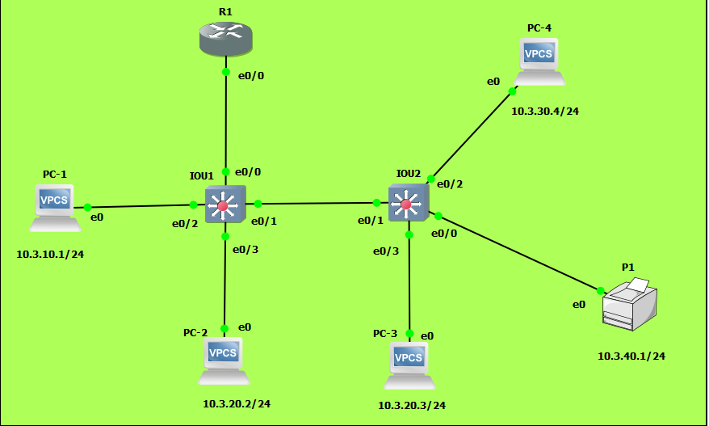

# TP3 : Routage INTER-VLAN + mise en situation

# Sommaire

* [I. *Router-on-a-stick*](#i-router-on-a-stick)
* [II. Cas concret](#ii-cas-concret)

# I. *Router-on-a-stick*


Schéma moche ftw :

```
             +--+
             |R1|
             +-++
               |
               |                    +---+
               |          +---------+PC4|
+---+        +-+-+      +---+       +---+
|PC1+--------+SW1+------+SW2|
+---+        +-+-+      +-+--+
               |          |  |
               |          |  +------+--+
               |          |         |P1|
             +-+-+      +-+-+       +--+
             |PC2|      |PC3|
             +---+      +---+
```



**Tableau des réseaux utilisés**

Réseau | Adresse | VLAN | Description
--- | --- | --- | ---
`net1` | `10.3.10.0/24` | 10 | Utilisateurs
`net2` | `10.3.20.0/24` | 20 | Admins
`net3` | `10.3.30.0/24` | 30 | Visiteurs
`netP` | `10.3.40.0/24` | 40 | Imprimantes

**Tableau d'adressage**

Machine | VLAN | IP `net1` | IP `net2` | IP `net3` |  IP `netP`
--- | --- | --- | --- | --- | ---
PC1 | 10 | `10.3.10.1/24` | x | x | x
PC2 | 20 | x | `10.3.20.2/24` | x | x | x
PC3 | 20 | x | `10.3.20.3/24` | x | x | x
PC4 | 30 | x | x |  `10.3.30.4/24` | x | x
P1 | 40 | x | x | x | `10.3.40.1/24` 
R1 | x |  `10.3.10.254/24` | `10.3.20.254/24` | `10.3.30.254/24` | `10.3.40.254/24` 

**Qui peut joindre qui ?**

✅ = peuvent se joindre
❌ = ne peuvent pas se joindre

Réseaux | `net1` |  `net2` |  `net3` |  `netP`
--- | --- | --- | --- | ---
 `net1` | ✅ | ❌ | ❌ | ❌
 `net2` | ❌ | ✅ | ✅ | ✅
 `net3` | ❌ | ✅ | ✅ | ✅
 `netP` | ❌ | ✅ | ✅ | ✅

**Instructions** (pretty straightforward) :
* Setup this shit
* You'll need inter-VLAN routing to make it work properly
  * se référer au [mémo Cisco section sous-interface](/memo/cli-cisco.md#sous-interface)
  * pour la partie "Qui peut joindre qui ?" vous n'avez besoin que de trunks avec des VLANs spécifiques autorisés
* 🌞 Prove me that your setup is actually working
  * PC1 
    ```
    PC-1> ping 10.3.20.2
    host (10.3.10.254) not reachable

    PC-1> ping 10.3.20.3
    host (10.3.10.254) not reachable

    PC-1> ping 10.3.30.4
    host (10.3.10.254) not reachable

    PC-1> ping 10.3.40.1
    host (10.3.10.254) not reachable
    ```

    PC2
    ```
    PC-2> ping 10.3.10.1
    10.3.10.1 icmp_seq=1 timeout

    PC-2> ping 10.3.20.3
    84 bytes from 10.3.20.3 icmp_seq=1 ttl=64 time=0.320 ms

    PC-2> ping 10.3.30.4
    10.3.30.4 icmp_seq=1 timeout

    PC-2> ping 10.3.30.4
    84 bytes from 10.3.30.4 icmp_seq=1 ttl=63 time=10.778 ms

    PC-2> ping 10.3.40.1
    84 bytes from 10.3.40.1 icmp_seq=3 ttl=63 time=17.253 ms
    ```

    PC3
    ```
    PC-3> ping 10.3.10.1
    10.3.10.1 icmp_seq=1 timeout

    PC-3> ping 10.3.20.2
    84 bytes from 10.3.20.2 icmp_seq=1 ttl=64 time=0.844 ms

    PC-3> ping 10.3.30.4
    84 bytes from 10.3.30.4 icmp_seq=1 ttl=63 time=20.818 ms

    PC-3> ping 10.3.40.1
    84 bytes from 10.3.40.1 icmp_seq=1 ttl=63 time=19.827 ms
    ```

    PC4
    ```
    PC-4> ping 10.3.10.1
    10.3.10.1 icmp_seq=1 timeout

    PC-4> ping 10.3.20.2
    84 bytes from 10.3.20.2 icmp_seq=1 ttl=63 time=15.342 ms

    PC-4> ping 10.3.20.3
    84 bytes from 10.3.20.3 icmp_seq=1 ttl=63 time=16.152 ms

    PC-4> ping 10.3.40.1
    84 bytes from 10.3.40.1 icmp_seq=3 ttl=63 time=19.946 ms
    ```

    Imprimante
    ```
    P1> ping 10.3.10.1
    10.3.10.1 icmp_seq=1 timeout

    P1> ping 10.3.20.2
    84 bytes from 10.3.20.2 icmp_seq=1 ttl=63 time=11.848 ms

    P1> ping 10.3.20.3
    84 bytes from 10.3.20.3 icmp_seq=3 ttl=63 time=14.226 ms

    P1> ping 10.3.30.4
    84 bytes from 10.3.30.4 icmp_seq=1 ttl=63 time=13.214 ms
    ```

# II. Cas concret

## Infra


**Qui a accès à qui exactement ?** (à mettre en place dans un second temps)  

✅ = peuvent se joindre
❌ = ne peuvent pas se joindre

X | Admins | Users | Stagiaires | Serveurs | SS | Imprimantes
--- | --- | --- | --- | --- | --- | --- | 
Admins | ✅ | ❌ | ❌ | ✅ | ✅ | ✅ |
Users | ❌ | ✅ | ❌ | ✅ | ❌ | ✅ |
Stagiaires | ❌ | ❌ | ✅ | ❌ | ❌ | ✅ |
Serveurs | ✅ | ✅ | ❌ | ✅ | ❌ | ✅ |
Serveurs sensibles | ✅ | ❌ | ❌ | ❌ | ✅ | ❌ |
Imprimantes | ✅ | ✅ | ✅ | ✅ | ❌ | ✅ |

---

**TODO**
* setup this shit in GNS3
  * 🌞 permettre un accès internet à tout le monde


**Exceptions** *(ce sont des bonus, voir la fin du TP*)
* tous les postes ne peuvent joindre que l'imprimante de leur propre salle
* les serveurs sensibles n'ont pas accès à internet
* seul l'admin 1 (`A1`) a accès au serveur 4 (`SRV4`)
**Bonus**
* 🐙 mettre en place les exceptions
  * documentez-vous, proposez des choses
* 🐙 mettre en place un serveur DHCP 
  * il devra 
    * s'intégrer à l'existant
    * être installé sur une VM dédiée (Virtualbox, Workstation)
    * permettre l'attribution d'IPs pour tous les PCs clients (admins, users, stagiaires)
    * libre choix de l'OS (m'enfin, déconnez pas, on va pas mettre un Windows Server 2016 si ?...)
  * mise en place d'un test avec l'ajout d'un nouveau client


## Infra


## Adressage IP

Chaque rôle est dans un réseau avec le même VLan.


### Salle R1

| Nom | Rôles | Net | IP | Vlan | NetMask
| ---- | ---- | ---- | ---- | ---- | ----
| Admin 3 | Admin | 192.168.10.0 | 192.168.10.3 | 10 | /29
| Printer 4 | Imprimante | 192.168.50.0 | 192.168.50.4 | 50 | /28
| Console 1 | Console | 192.168.60.0 | 192.168.60.1 | 60 | /29


### Salle R2

| Nom | Rôles | Net | IP | Vlan | NetMask
| ---- | ---- | ---- | ---- | ---- | ----
| Serveur 1 | Serveur | 192.168.45.0 | 192.168.45.1 | 45 | /28
| Serveur 2 | Serveur | 192.168.40.0 | 192.168.40.2 | 40 | /28
| Serveur 3 | Serveur | 192.168.40.0 | 192.168.40.3 | 40 | /28
| Serveur 4 | Serveur | 192.168.40.0 | 192.168.40.4 | 40 | /28
| Serveur 5 | Serveur | 192.168.40.0 | 192.168.40.5 | 40 | /28
| Serveur 6 | Serveur | 192.168.45.0 | 192.168.45.6 | 45 | /28


### Salle R3

| Nom | Rôles | Net | IP | Vlan | NetMask
| ---- | ---- | ---- | ---- | ---- | ----
| User 5 | User | 192.168.20.0 | 192.168.20.5 | 20 | /27
| User 6 | User | 192.168.20.0 | 192.168.20.6 | 20 | /27
| User 7 | User | 192.168.20.0 | 192.168.20.7 | 20 | /27
| User 8 | User | 192.168.20.0 | 192.168.20.8 | 20 | /27
| User 9 | User | 192.168.20.0 | 192.168.20.9 | 20 | /27
| User 10 | User | 192.168.20.0 | 192.168.20.10 | 20 | /27
| Stagiaire 4 | Stagiaire | 192.168.30.0 | 192.168.30.4 | 30 | /28
| Stagiaire 5 | Stagiaire | 192.168.30.0 | 192.168.30.5 | 30 | /28
| Printer 2 | Imprimante | 192.168.50.0 | 192.168.50.2 | 50 | /28

### Salle R4

| Nom | Rôles | Net | IP | Vlan | NetMask
| ---- | ---- | ---- | ---- | ---- | ----
| Admin 1 | Admin | 192.168.10.0 | 192.168.10.1 | 10 | /29
| User 1 | User | 192.168.20.0 | 192.168.20.1 | 20 | /27
| User 2 | User | 192.168.20.0 | 192.168.20.2 | 20 | /27
| User 3 | User | 192.168.20.0 | 192.168.20.3 | 20 | /27
| User 4 | User | 192.168.20.0 | 192.168.20.4 | 20 | /27
| Stagiaire 1 | Stagiaire | 192.168.30.0 | 192.168.30.1 | 30 | /28
| Stagiaire 2 | Stagiaire | 192.168.30.0 | 192.168.30.2 | 30 | /28
| Stagiaire 3 | Stagiaire | 192.168.30.0 | 192.168.30.3 | 30 | /28
| Printer 1 | Imprimante | 192.168.50.0 | 192.168.50.1 | 50 | /28

### Salle R5

| Nom | Rôles | Net | IP | Vlan | NetMask
| ---- | ---- | ---- | ---- | ---- | ----
| Admin 2 | Admin | 192.168.10.0 | 192.168.10.2 | 10 | /29
| User 11 | User | 192.168.20.0 | 192.168.20.11 | 20 | /27
| User 12 | User | 192.168.20.0 | 192.168.20.12 | 20 | /27
| User 13 | User | 192.168.20.0 | 192.168.20.13 | 20 | /27
| User 14 | User | 192.168.20.0 | 192.168.20.14 | 20 | /27
| User 15 | User | 192.168.20.0 | 192.168.20.15 | 20 | /27
| User 16 | User | 192.168.20.0 | 192.168.20.16 | 20 | /27
| Stagiaire 6 | Stagiaire | 192.168.30.0 | 192.168.30.6 | 30 | /28
| Stagiaire 7 | Stagiaire | 192.168.30.0 | 192.168.30.7 | 30 | /28
| Stagiaire 8 | Stagiaire | 192.168.30.0 | 192.168.30.8 | 30 | /28
| Printer 3 | Imprimante | 192.168.50.0 | 192.168.50.3 | 50 | /28


## Routeur et switchs

### Switchs

Il nous faudra 6 switchs, un pour chaque salle et un pour lier les switchs au routeur.
Concernant les switch par salle, ils seront situés en hauteur afin de ne pas avoir les câbles qui trainent par terre.

### Routeur

Il nous faudra un seul routeur qui sera placé dans la salle serveur.

## Câbles

Il nous faudra un câble de **moyenne** longueur pour chacune des machines à leur switch
Un câble *long* pour relier les switch au switch du routeur
Un câble *moyen* pour relier le switch du routeur au routeur


Cela fait donc 36 câbles **moyens** et 5 câbles **longs**


## Qui a accès à qui

Pour arriver à nos fins nous avons dû utiliser les ACL.
Une ACL permet de filtrer les accès à un réseau et est située sur le routeur.
Le level des docs sur les ACL nous a obligé à attendre que Mathieu puisse nous donner un avis nouveau parce qu'on avait mal config nos ACL.

```
R1#show access-list
Extended IP access list 101
    10 deny ip 192.168.10.0 0.0.0.7 192.168.20.0 0.0.0.31 (42 matches)
    20 deny ip 192.168.10.0 0.0.0.7 192.168.30.0 0.0.0.15 (6 matches)
    30 permit ip any any (30 matches)
Extended IP access list 102
    10 deny ip 192.168.20.0 0.0.0.31 192.168.10.0 0.0.0.7 (6 matches)
    20 deny ip 192.168.20.0 0.0.0.31 192.168.30.0 0.0.0.15 (3 matches)
    30 deny ip 192.168.20.0 0.0.0.31 192.168.45.0 0.0.0.15 (3 matches)
    40 permit ip any any (12 matches)
Extended IP access list 103
    10 deny ip 192.168.30.0 0.0.0.15 192.168.10.0 0.0.0.7 (6 matches)
    20 deny ip 192.168.30.0 0.0.0.15 192.168.20.0 0.0.0.31 (3 matches)
    30 deny ip 192.168.30.0 0.0.0.15 192.168.40.0 0.0.0.15 (3 matches)
    40 deny ip 192.168.30.0 0.0.0.15 192.168.45.0 0.0.0.15 (6 matches)
    50 permit ip 192.168.30.0 0.0.0.15 192.168.50.0 0.0.0.7 (5 matches)
    60 permit ip any any
Extended IP access list 104
    10 deny ip 192.168.40.0 0.0.0.15 192.168.30.0 0.0.0.15 (6 matches)
    20 deny ip 192.168.40.0 0.0.0.15 192.168.45.0 0.0.0.15 (6 matches)
    30 permit ip 192.168.40.0 0.0.0.15 192.168.50.0 0.0.0.7 (5 matches)
    40 permit ip 192.168.40.0 0.0.0.15 192.168.10.0 0.0.0.7 (11 matches)
    50 permit ip 192.168.40.0 0.0.0.15 192.168.20.0 0.0.0.31 (6 matches)
    60 permit ip any any
Extended IP access list 105
    10 permit ip 192.168.45.0 0.0.0.15 192.168.10.0 0.0.0.7 (7 matches)
    20 deny ip 192.168.45.0 0.0.0.15 192.168.20.0 0.0.0.31 (3 matches)
    30 deny ip 192.168.45.0 0.0.0.15 192.168.30.0 0.0.0.15 (3 matches)
    40 deny ip 192.168.45.0 0.0.0.15 192.168.40.0 0.0.0.15 (3 matches)
    50 deny ip 192.168.45.0 0.0.0.15 192.168.50.0 0.0.0.7 (9 matches)
    60 permit ip any any
Extended IP access list 106
    10 permit ip 192.168.50.0 0.0.0.7 192.168.10.0 0.0.0.7 (5 matches)
    20 permit ip 192.168.50.0 0.0.0.7 192.168.20.0 0.0.0.31 (2 matches)
    30 permit ip 192.168.50.0 0.0.0.7 192.168.30.0 0.0.0.15 (5 matches)
    40 permit ip 192.168.50.0 0.0.0.7 192.168.40.0 0.0.0.15 (5 matches)
    50 deny ip 192.168.50.0 0.0.0.7 192.168.45.0 0.0.0.15 (6 matches)
    60 permit ip any any (69 matches)

```

**Ping d'un admin**

```
VPCS> ping 192.168.20.1
*192.168.10.6 icmp_seq=1 ttl=255 time=5.524 ms (ICMP type:3, code:13, Communication administratively prohibited)
*192.168.10.6 icmp_seq=2 ttl=255 time=12.076 ms (ICMP type:3, code:13, Communication administratively prohibited)
^C
VPCS> ping 192.168.30.1
*192.168.10.6 icmp_seq=1 ttl=255 time=5.252 ms (ICMP type:3, code:13, Communication administratively prohibited)
*192.168.10.6 icmp_seq=2 ttl=255 time=7.516 ms (ICMP type:3, code:13, Communication administratively prohibited)
^C
VPCS> ping 192.168.40.2
84 bytes from 192.168.40.2 icmp_seq=1 ttl=63 time=15.329 ms
84 bytes from 192.168.40.2 icmp_seq=2 ttl=63 time=14.473 ms
^C
VPCS> ping 192.168.45.1
192.168.45.1 icmp_seq=1 timeout
192.168.45.1 icmp_seq=2 timeout
84 bytes from 192.168.45.1 icmp_seq=3 ttl=63 time=16.882 ms
^C
VPCS> ping 192.168.50.1
192.168.50.1 icmp_seq=1 timeout
192.168.50.1 icmp_seq=2 timeout
84 bytes from 192.168.50.1 icmp_seq=3 ttl=63 time=20.068 ms
^C
VPCS>

```

**Ping d'un user**

```
User-8> ping 192.168.10.1
*192.168.20.30 icmp_seq=1 ttl=255 time=9.411 ms (ICMP type:3, code:13, Communication administratively prohibited)
*192.168.20.30 icmp_seq=2 ttl=255 time=7.869 ms (ICMP type:3, code:13, Communication administratively prohibited)
^C
User-8> ping 192.168.30.1
*192.168.20.30 icmp_seq=1 ttl=255 time=7.273 ms (ICMP type:3, code:13, Communication administratively prohibited)
^C
User-8> ping 192.168.40.1
192.168.40.1 icmp_seq=1 timeout
192.168.40.1 icmp_seq=2 timeout
^C
User-8> ping 192.168.40.2
192.168.40.2 icmp_seq=1 timeout
192.168.40.2 icmp_seq=2 timeout
84 bytes from 192.168.40.2 icmp_seq=3 ttl=63 time=18.102 ms
^C
User-8> ping 192.168.45.1
*192.168.20.30 icmp_seq=1 ttl=255 time=5.549 ms (ICMP type:3, code:13, Communication administratively prohibited)
^C
User-8> ping 192.168.50.1
84 bytes from 192.168.50.1 icmp_seq=1 ttl=63 time=17.047 ms
^C

```


**Ping d'un stagiaire**

```
VPCS> ping 192.168.10.1
*192.168.30.14 icmp_seq=1 ttl=255 time=8.982 ms (ICMP type:3, code:13, Communication administratively prohibited)
*192.168.30.14 icmp_seq=2 ttl=255 time=7.746 ms (ICMP type:3, code:13, Communication administratively prohibited)
^C
VPCS> ping 192.168.20.1
*192.168.30.14 icmp_seq=1 ttl=255 time=2.542 ms (ICMP type:3, code:13, Communication administratively prohibited)
^C
VPCS> ping 192.168.30.1
192.168.30.1 icmp_seq=1 ttl=64 time=0.001 ms
192.168.30.1 icmp_seq=2 ttl=64 time=0.001 ms
192.168.30.1 icmp_seq=3 ttl=64 time=0.001 ms
192.168.30.1 icmp_seq=4 ttl=64 time=0.001 ms
192.168.30.1 icmp_seq=5 ttl=64 time=0.001 ms

VPCS>
VPCS> ping 192.168.40.1
*192.168.30.14 icmp_seq=1 ttl=255 time=4.338 ms (ICMP type:3, code:13, Communication administratively prohibited)
^C
VPCS> ping 192.168.45.1
*192.168.30.14 icmp_seq=1 ttl=255 time=7.268 ms (ICMP type:3, code:13, Communication administratively prohibited)
*192.168.30.14 icmp_seq=2 ttl=255 time=6.995 ms (ICMP type:3, code:13, Communication administratively prohibited)
^C
VPCS> ping 192.168.50.1
192.168.50.1 icmp_seq=1 timeout
192.168.50.1 icmp_seq=2 timeout
^C

```

**Ping d'un Serveur**

```

VPCS> ping 192.168.10.1
192.168.10.1 icmp_seq=1 timeout
84 bytes from 192.168.10.1 icmp_seq=2 ttl=63 time=13.800 ms
84 bytes from 192.168.10.1 icmp_seq=3 ttl=63 time=17.975 ms
84 bytes from 192.168.10.1 icmp_seq=4 ttl=63 time=19.191 ms
^C
VPCS> ping 192.168.20.1
192.168.20.1 icmp_seq=1 timeout
192.168.20.1 icmp_seq=2 timeout
84 bytes from 192.168.20.1 icmp_seq=3 ttl=63 time=13.842 ms
^C
VPCS> ping 192.168.30.1
*192.168.40.14 icmp_seq=1 ttl=255 time=12.056 ms (ICMP type:3, code:13, Communication administratively prohibited)
*192.168.40.14 icmp_seq=2 ttl=255 time=8.056 ms (ICMP type:3, code:13, Communication administratively prohibited)
^C
VPCS> ping 192.168.45.1
*192.168.40.14 icmp_seq=1 ttl=255 time=7.293 ms (ICMP type:3, code:13, Communication administratively prohibited)
*192.168.40.14 icmp_seq=2 ttl=255 time=8.876 ms (ICMP type:3, code:13, Communication administratively prohibited)
^C
VPCS> ping 192.168.50.1
192.168.50.1 icmp_seq=1 timeout
192.168.50.1 icmp_seq=2 timeout
84 bytes from 192.168.50.1 icmp_seq=3 ttl=63 time=13.718 ms
^C

```

**Ping d'un Serveur Sécurisé**

```
VPCS> ping 192.168.10.1
84 bytes from 192.168.10.1 icmp_seq=1 ttl=63 time=19.836 ms
84 bytes from 192.168.10.1 icmp_seq=2 ttl=63 time=17.676 ms
^C
VPCS> ping 192.168.20.1
*192.168.45.14 icmp_seq=1 ttl=255 time=11.054 ms (ICMP type:3, code:13, Communication administratively prohibited)
^C
VPCS> ping 192.168.30.1
*192.168.45.14 icmp_seq=1 ttl=255 time=8.423 ms (ICMP type:3, code:13, Communication administratively prohibited)
^C
VPCS> ping 192.168.40.1
*192.168.45.14 icmp_seq=1 ttl=255 time=4.747 ms (ICMP type:3, code:13, Communication administratively prohibited)
^C
VPCS> ping 192.168.50.1
*192.168.45.14 icmp_seq=1 ttl=255 time=3.913 ms (ICMP type:3, code:13, Communication administratively prohibited)
*192.168.45.14 icmp_seq=2 ttl=255 time=7.545 ms (ICMP type:3, code:13, Communication administratively prohibited)
*192.168.45.14 icmp_seq=3 ttl=255 time=4.614 ms (ICMP type:3, code:13, Communication administratively prohibited)

```

**Ping d'une Imprimante**

```
VPCS> ping 192.168.10.1
84 bytes from 192.168.10.1 icmp_seq=1 ttl=63 time=19.944 ms
^C
VPCS> ping 192.168.20.1
84 bytes from 192.168.20.1 icmp_seq=1 ttl=63 time=12.447 ms
^C
VPCS> ping 192.168.30.1
192.168.30.1 icmp_seq=1 timeout
192.168.30.1 icmp_seq=2 timeout
84 bytes from 192.168.30.1 icmp_seq=3 ttl=63 time=18.243 ms
^C
VPCS> ping 192.168.40.2
84 bytes from 192.168.40.2 icmp_seq=1 ttl=63 time=15.758 ms
84 bytes from 192.168.40.2 icmp_seq=2 ttl=63 time=20.560 ms
^C
VPCS> ping 192.168.45.1
*192.168.50.14 icmp_seq=1 ttl=255 time=3.305 ms (ICMP type:3, code:13, Communication administratively prohibited)
*192.168.50.14 icmp_seq=2 ttl=255 time=6.251 ms (ICMP type:3, code:13, Communication administratively prohibited)
^C

```