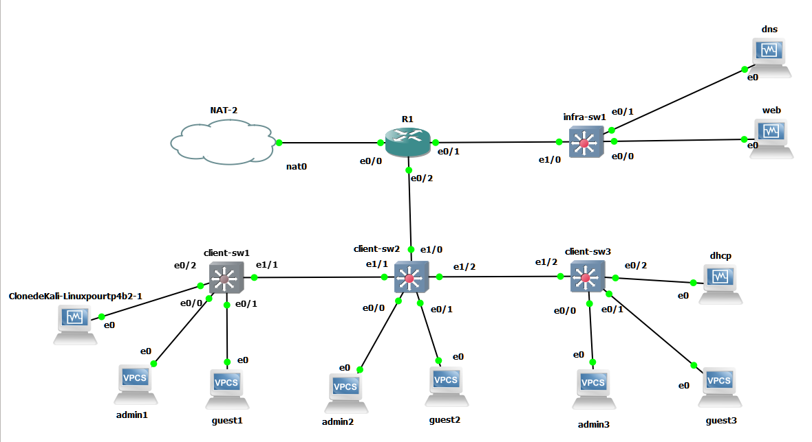
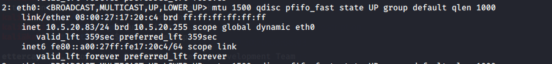
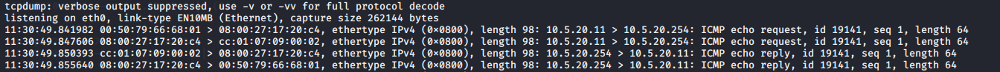
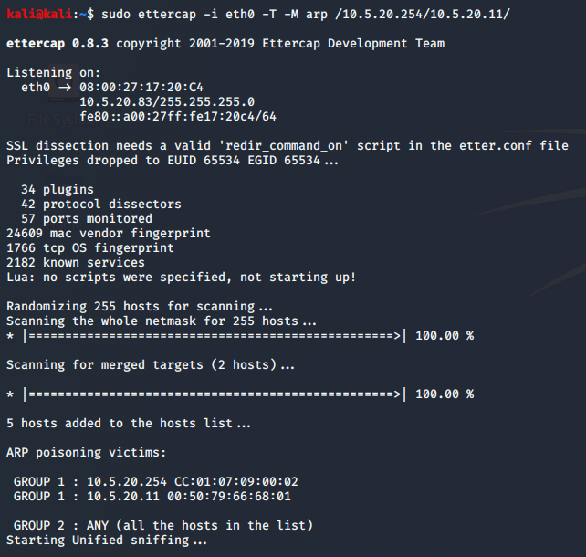
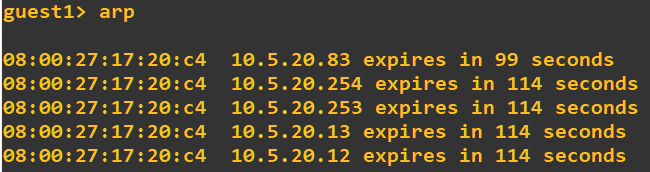
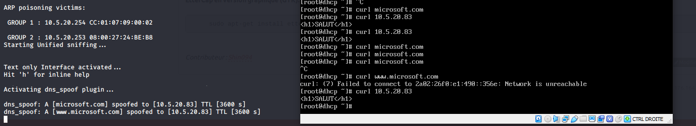
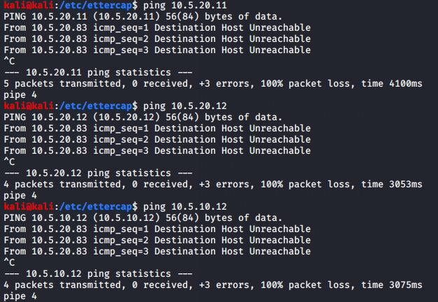

# TP4 : Buffet à volonté
# Index 

<!-- vim-markdown-toc GitLab -->

* [Sujet global : refresh](#sujet-global-refresh)
    * [La topo](#la-topo)
        * [Schéma GNS](#schéma-gns)
        * [Tableau des réseaux](#tableau-des-réseaux)
        * [Tableau d'adressage](#tableau-dadressage)
        * [Fichiers de conf](#Fichiers-de-conf)
        * [Preuve mise en place](#Preuve-mise-en-place)
    * [Sécurité attack & defense : spoofing, VLAN attack](#sécurité-attack-defense-spoofing-vlan-attack)
        * [A. Offensive](#a-offensive)
            * [ARP Spoofing](#arp-spoofing)
            * [DNS Spoofing](#dns-spoofing)
        * [B. Defensive](#b-defensive)
            * [ARP Spoofing / DHCP Spoofing](#arp-spoofing-DHCP-Spoofing)


## La topo

### Schéma GNS

<div align="center"></div>

### Tableau des réseaux

| Name     | Address        | VLAN |
|----------|----------------|------|
| `admins` | `10.5.10.0/24` | 10   |
| `guests` | `10.5.20.0/24` | 20   |
| `infra`  | `10.5.30.0/24` | 30   |

### Tableau d'adressage

| Machine  | `admins`      | `guests`      | `infra`       |
|----------|---------------|---------------|---------------|
| `r1`     | `10.5.10.254` | `10.5.20.254` | `10.5.30.254` |
| `admin1` | `10.5.10.11`  | x             | x             |
| `admin2` | `10.5.10.12`  | x             | x             |
| `admin3` | `10.5.10.13`  | x             | x             |
| `guest1` | x             | `10.5.20.11` ou `10.5.20.86` (après dhcp)  | x             |
| `guest2` | x             | `10.5.20.12`  | x             |
| `guest3` | x             | `10.5.20.13`  | x             |
| `kali` | x             | `10.5.20.83`  | x             |
| `dhcp`   | x             | `10.5.20.253` | x             |
| `dns`    | x             | x             | `10.5.30.11`  |
| `web`    | x             | x             | `10.5.30.12`  |

### Fichiers de conf
* [client-sw1](./conf/client-sw1)
* [client-sw2](./conf/client-sw2)
* [client-sw3](./conf/client-sw3)
* [infra-sw1](./conf/infra-sw1)
* [R1](./conf/R1)

### Preuve mise en place

* Router:
    * ```
        R1#show ip int br
        Interface                  IP-Address      OK? Method Status                Protocol
        Ethernet0/0                192.168.122.85  YES DHCP   up                    up
        Ethernet0/1                unassigned      YES NVRAM  up                    up
        Ethernet0/1.30             10.5.30.254     YES NVRAM  up                    up
        Ethernet0/2                unassigned      YES NVRAM  up                    up
        Ethernet0/2.10             10.5.10.254     YES NVRAM  up                    up
        Ethernet0/2.20             10.5.20.254     YES NVRAM  up                    up
        Ethernet0/3                unassigned      YES NVRAM  administratively down down
        NVI0                       unassigned      NO  unset  up                    up

        ```

* DHCP:

    guest1
    * ```
        NAME        : guest1[1]
        IP/MASK     : 10.5.20.86/24
        GATEWAY     : 10.5.20.254
        DNS         : 10.5.30.11
        DHCP SERVER : 10.5.20.253
        DHCP LEASE  : 322, 600/300/525
        DOMAIN NAME : tp4.b2
        MAC         : 00:50:79:66:68:01
        LPORT       : 10032
        RHOST:PORT  : 127.0.0.1:10033
        MTU:        : 1500
        ```
    vm kali
    * 


* Ping:
    
    Vers internet
    * depuis admin3: 
        ```
        admin3> ping 8.8.8.8
        84 bytes from 8.8.8.8 icmp_seq=1 ttl=55 time=61.567 ms
        ```
    Dans le LAN
    * depuis guest2:
        ```
        guest2> ping 10.5.20.13
        84 bytes from 10.5.20.13 icmp_seq=1 ttl=64 time=0.429 ms
        ```


## Sécurité attack & defense : spoofing, VLAN attack

**But : hackers gonna hack (or not ?)**
* mettre en place des attaques réseau
* mettre en place des contremesures

### A. Offensive 

#### ARP Spoofing

Usurpation d'identité L2/L3 : on usurpe l'adresse IP d'une machine du réseau en empoisonnant la table ARP de la victime.

Après avoir réparé mon `apt-get` avec ce [tuto](https://ourcodeworld.com/articles/read/961/how-to-solve-kali-linux-apt-get-install-e-unable-to-locate-package-checkinstall)

J'ai donc suivit ton tuto pour [`arping`](https://sandilands.info/sgordon/arp-spoofing-on-wired-lan)


je suis le tp pour l'arpspoofing, arrive le moment où on fait un arping en se faisant passer pour une autre adresse ip, et là je me dis que c'est une bonne idée de se faire passer pour le 254 et puis de test sur le client s'il ping toujours la broadcast après ça et là le drame, il peut plus, j'attend donc la fin du temps de vie de la table arp (j'ai oublié qu'on pouvait clear manuellement la table) et je refais un ping vers mon 254 avec le client et tout marche !

je re test de faire l'arping arpès avoir pu contacter la gateway avec mon client et je me rend compte que l'adresse mac n'est pas changé côté table arp du client mais par contre le timer de la table arp recommence comme si c'était vraiment la vrai gateway qui venait de parlait à mon client

je décide de faire un dernier test: je ping `8.8.8.8` avec mon client s'il pense que mon kali est le .254. 

Conclusion: Non, donc on peut donc faire croire à une personne qu'elle est complètement seule dans le réseau et ceux juste en la spammant avec `sudo arping -c 1 -U -s "adresse ip de votre choix" -I eth0 "adresse ip victime"` ceci couplé avec petit script qui spam la commande avec toutes les adresses possible sur le réseau !

Je décide de faire un `tcpdump` sur ma kali pour enregistrer un ping de ma guest1 vers sa gateway en sachant qu'il pense que ma vm kali est sa gateway



Donc on voit clairement notre guest1 (mac:`00:50:79:66:68:01`) faire un ping vers le `10.5.20.254` qui se trouve être notre kali qui fait du arpspoofing (mac:`08:00:27:17:20:c4`) et notre kali recevant le trame de ping de notre guest redirige cette demande vers `cc:01:07:09:00:02` qui se trouve être l'adresse mac de notre réelle gateway 
```
Ethernet0/2.20 is up, line protocol is up
  Hardware is AmdP2, address is cc01.0709.0002 (bia cc01.0709.0002)
  Internet address is 10.5.20.254/24

```

#### DNS Spoofing

Je décide de faire le dns spoofing avec ettercap et de l'arp spoofing



Comme on peut le voir ici, il fonctionne assez bien 


Mais le but du dns spoofing est de pouvoir tromper un client sur le site qu'il cherche, bon de mon côté cela a presque fonctionné :/


Comme tu peux le voir, ma vm kali (à gauche) reçoit la trame de curl et la redirige vers elle même, mais comme tu peux le voir à droite mon curl de `www.microsoft.com` se fait `unreachable` et pourtant lorsque je curl directement l'adresse ip de ma vm kali `10.5.20.83` je récupère bien le contenu de ma page. Je ne sais pas où j'ai raté la redirection.

### B. Defensive

#### ARP Spoofing DHCP Spoofing

Mise en place d'un *IP source guard*.

Mise en place de *DHCP snooping* qui permet d'interdire des trames DHCP sur les ports non-autorisés.

Alors n'ayant que très peu de notion d'attaque, tu te doutes bien que j'en ai encore moins de défense, donc j'ai suivit un [tuto](https://packetpushers.net/ccnp-studies-configuring-ip-source-guard/) qui si je comprend bien mélange l'*IP source guard* et le *DHCP snooping* et comme tu peux le voir, il marche un peu trop bien.


Ma vm kali vient de se faire punir du réseau et elle ne peut joindre personne et être joint par personne `¯\_(ツ)_/¯`
<br>
<br>
<br>
<br>
C'était vraiment cool de faire un peu d'attaque et de défense en même temps, c'était un peu obscure pour la partie défense mais j'ai vue pas mal de chose interessante à mes yeux !